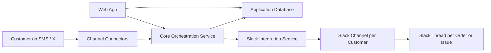

# CS Simplified

## Product title

CS Simplified: A simplified multi modal customer support platform. Meeting customers where they are.

## Product summary

CS Simplified is a Slack-first omnichannel customer support platform for small and medium ecommerce brands. It allows customers to contact a business from the channel they already use, such as SMS or X, while support agents work primarily from Slack. The platform acts as the central orchestration layer for customer identity, support tickets, message history, Slack routing, and operational status.

## Positioning

### Primary market

- Small and medium ecommerce businesses
- Teams that already use Slack internally
- Businesses that want better customer responsiveness without buying a large enterprise support suite

### Expansion path

- Can later support B2B account management workflows
- Can later support more structured account channels, approvals, and SLA management

## Problem statement

Traditional support channels force the customer to switch context into email, phone, or a dedicated support portal. Businesses then need to manage multiple tools or pay for limited third-party platforms that do not fit their workflow well.

This creates three problems:

- Customers have to leave the channel they are already using
- Support teams end up split across disconnected tools
- The business loses unified visibility into customer history and support status

## Product goal

Create a central support application that:

- Receives customer messages from multiple external channels
- Resolves each incoming request to a known customer identity where possible
- Routes the request into Slack where support agents already work
- Keeps the application database as the system of record for support interactions, ticket state, customer identities, and Slack mappings
- Lets the web app manage status, reporting, mappings, and future admin controls

## Core product principle

Customers stay in their channel. Agents stay in Slack. The application holds the memory and routing logic between them.

## MVP scope

### In scope for v1

- Inbound channel connectors:
  - SMS
  - X
- Slack as the primary agent workspace
- Web app for support operations and ticket administration
- Customer identity capture and mapping
- One Slack channel per customer/account
- One Slack thread per order or support issue
- Ticket status updates from the web app
- Slack visual status indicators using emoji reactions
- Persistent database-backed record of customers, identities, tickets, messages, and Slack mappings

### Out of scope for v1

- Full native agent console replacing Slack
- AI auto-resolution
- Advanced analytics dashboards
- Voice transcription pipeline
- Billing, metering, or tenant self-service onboarding
- Deep integrations with all social networks on day one

## Channel strategy

### MVP channels

- SMS
- X

### Future channels

- Instagram
- Facebook
- Email
- WhatsApp
- Phone
- Web chat

## Slack workspace model

### Recommended MVP design

- One Slack channel per customer/account
- One thread per order or support issue

### Why this works for SMB ecommerce

- Gives agents a stable customer-specific workspace
- Preserves the full history of a customer in one place
- Keeps multiple orders or issues organized using threads
- Fits higher-touch support better than a single giant queue

### Scale note

This model is correct for the MVP. If the product later supports very high customer volume, the platform can introduce alternate routing strategies such as:

- Shared queue channels for low-touch customers
- Dedicated customer channels only for VIP, high-value, or repeat customers
- Brand-configurable routing policy

## Ticket lifecycle

### Proposed statuses

- `new`
- `assigned`
- `waiting_on_customer`
- `resolved`
- `closed`

### Status meaning

- `new`: inbound request has been created and not yet picked up
- `assigned`: an agent has taken ownership
- `waiting_on_customer`: the business has replied and is waiting for customer response
- `resolved`: the issue is solved from the team perspective
- `closed`: the conversation is complete and should not receive further agent work in the same thread

### Reopen rule

If a previously closed issue receives a new customer request:

- Do not reuse the old Slack thread
- Create a new ticket
- Create a new Slack thread inside the same customer Slack channel

This keeps historical discussions clean and prevents closed issues from becoming ambiguous.

## Slack behavior

### Channel creation

When a customer first appears in the system:

- Create a Slack channel for that customer
- Recommended naming pattern:
  - `acct-<customer-name>-slack`
- Store the channel mapping in the application database

### Thread creation

When a new request arrives:

- If there is an open ticket for the same customer and order or issue key, reuse that Slack thread
- If there is no matching open ticket, create a new Slack thread
- If the last matching ticket is closed, create a new Slack thread

### Slack status signaling

- `assigned`: add `:eyes:` to the Slack thread
- `closed`: add `:white_check_mark:` to the Slack thread

### Future Slack enhancements

- Agent assignment reflected in thread starter or message metadata
- Priority markers like `:warning:`
- Slash commands for ticket actions
- Buttons or workflows for status updates from Slack itself

## User roles

### Customer

- Sends questions from their preferred external channel
- Receives replies in the same channel

### Support agent

- Works primarily from Slack
- Reviews customer context and collaborates in Slack threads
- Responds to customer issues

### Support lead or admin

- Uses the web app to manage ticket states
- Reviews customer mappings and history
- Monitors conversations and support workflow health
- Manages connector and database configuration in later phases

## Primary user flows

### Flow 1: new inbound support request

1. Customer sends a message from SMS or X
2. Connector receives the inbound event
3. Platform normalizes the message into a common internal schema
4. Platform attempts to match the sender to an existing customer identity
5. If no customer is found, a new customer record is created
6. Platform checks for an existing open ticket for the same customer and order or issue key
7. If none exists, a new ticket is created
8. Platform creates or reuses the customer Slack channel
9. Platform creates or reuses the correct Slack thread
10. Platform posts the inbound message into Slack
11. Ticket and message records are stored in the database

### Flow 2: agent replies from Slack

1. Agent reviews the Slack thread
2. Agent replies internally or prepares a customer-facing response
3. Platform captures the reply event
4. If the reply is customer-facing, platform sends it back to the original source channel
5. Delivery status is recorded in the database
6. Ticket status may change to `waiting_on_customer`

### Flow 3: status update from the web app

1. Support lead opens the ticket in the app
2. Status is changed to `assigned`, `resolved`, or `closed`
3. Platform updates the database
4. Platform mirrors status to Slack using emoji markers or future richer metadata

### Flow 4: closed ticket receives new contact

1. Customer sends a new follow-up after the old ticket is closed
2. Platform recognizes customer and related order or account
3. Platform creates a new ticket
4. Platform creates a new Slack thread in the existing customer channel
5. Old closed thread remains unchanged

## Identity model

### Goal

A single customer may have multiple identities across channels. The platform should map them to one customer record when confidence is high.

### Supported identity examples

- Phone number
- Email address
- X handle
- Instagram handle
- Facebook handle
- External platform user ID

### MVP matching rules

- Auto-link when a trusted unique identifier matches:
  - same phone number
  - same verified email
  - same known external user ID
- If confidence is not high enough:
  - create or flag a candidate identity mapping for review

This reduces the risk of incorrectly merging two customers into one record.

## Data model

### Customer

- `id`
- `name`
- `primary_email`
- `primary_phone`
- `created_at`
- `updated_at`

### CustomerIdentity

- `id`
- `customer_id`
- `source_type`
- `external_identifier`
- `display_handle`
- `verified`
- `created_at`
- `updated_at`

### Order

- `id`
- `customer_id`
- `external_order_number`
- `order_status`
- `order_payload`
- `created_at`
- `updated_at`

### Ticket

- `id`
- `customer_id`
- `order_id` nullable
- `source_channel`
- `subject`
- `status`
- `priority`
- `assigned_to` nullable
- `opened_at`
- `resolved_at` nullable
- `closed_at` nullable
- `created_at`
- `updated_at`

### Message

- `id`
- `ticket_id`
- `direction`
- `author_type`
- `source_channel`
- `raw_content`
- `normalized_content`
- `source_link` nullable
- `external_message_id` nullable
- `created_at`

### SlackChannelMap

- `id`
- `customer_id`
- `slack_channel_id`
- `slack_channel_name`
- `created_at`

### SlackThreadMap

- `id`
- `ticket_id`
- `slack_channel_id`
- `slack_thread_ts`
- `thread_status`
- `created_at`
- `closed_at` nullable

### DeliveryLog

- `id`
- `ticket_id`
- `message_id`
- `destination_channel`
- `delivery_status`
- `external_delivery_id` nullable
- `error_payload` nullable
- `created_at`

### StatusEvent

- `id`
- `ticket_id`
- `old_status`
- `new_status`
- `changed_by`
- `change_source`
- `created_at`

## Architecture

### Logical components

- `Connector layer`
  - Handles inbound and outbound integration with SMS, X, and future channels

- `Core orchestration service`
  - Normalizes inbound events
  - Resolves customer identity
  - Decides whether to create or reuse tickets
  - Manages Slack routing

- `Slack integration service`
  - Creates channels
  - Creates threads
  - Posts messages
  - Adds status reactions

- `Application database`
  - System of record for support tickets, mappings, histories, and configuration
  - Future feature: customer can bring their own database provider

- `Web application`
  - Admin and support operations surface
  - Ticket status control
  - Customer and history lookup
  - Connector and reporting features in later phases

### Suggested architecture diagram

## Database strategy

### Product stance

The application database is the system of record for support activity and customer-channel mappings.

### Bring-your-own-database option

This can be positioned as a product feature:

- Hosted default database for simple onboarding
- Bring-your-own database provider for businesses with security or infrastructure preferences

### Recommended implementation path

- MVP:
  - single managed relational database such as PostgreSQL
- Later:
  - configurable provider model
  - tenant-level database configuration

## Order data strategy

The support platform should be the source of truth for support data, but not necessarily the sole source of truth for commerce data.

Recommended approach:

- Store support-owned records natively in the app database
- Sync or cache order details from ecommerce systems like Shopify or OMS tools when needed
- Preserve external references so order state can be refreshed or verified later

This keeps the product practical and easier to integrate into real ecommerce operations.

## Non-functional requirements

- Reliable message ingestion and retry behavior
- Clear audit trail for inbound, outbound, and status actions
- Idempotent connector processing to avoid duplicate tickets
- Secure storage of connector credentials
- Role-based access in later phases
- Scalable connector model for new channel additions

## MVP admin web app

### Required capabilities

- View customer list
- View tickets by status
- Open ticket detail with full message history
- View mapped Slack channel and thread
- Change ticket status
- View delivery attempts and connector events

### Nice-to-have soon after MVP

- Search by customer, order, phone, or handle
- Manual identity merge or correction
- Assignment controls
- Priority controls
- Notes visible only to internal agents

## Recommended build phases

### Phase 1: product skeleton

- Customer records
- Ticket records
- Message records
- Slack mapping tables
- Web app shell
- Simulated channel inputs

### Phase 2: working MVP integrations

- Real Slack integration
- SMS connector
- X connector
- Thread creation and reuse logic
- Status sync to Slack

### Phase 3: operational maturity

- Search
- Identity review tools
- Delivery retries
- Reporting
- Role-based access

### Phase 4: expansion

- Instagram and Facebook
- Ecommerce platform integrations
- Bring-your-own-database configuration
- B2B routing options

## Open decisions for the next pass

- Exact definition of how to detect an "existing issue" when there is no order ID
- Whether a customer can have multiple open threads for one order across different issue types
- How Slack agents mark a reply as internal-only versus customer-facing
- Whether the app should support assignment from Slack, web app, or both in MVP
- Whether the MVP includes authentication or remains a local prototype first

## Recommended next implementation target

Build the MVP as a Slack-first local prototype with:

- simulated inbound SMS and X events
- real ticket lifecycle and status model
- channel-per-customer and thread-per-issue routing logic
- admin web app for visibility and status updates

That will validate the operating model before adding real external connectors.
